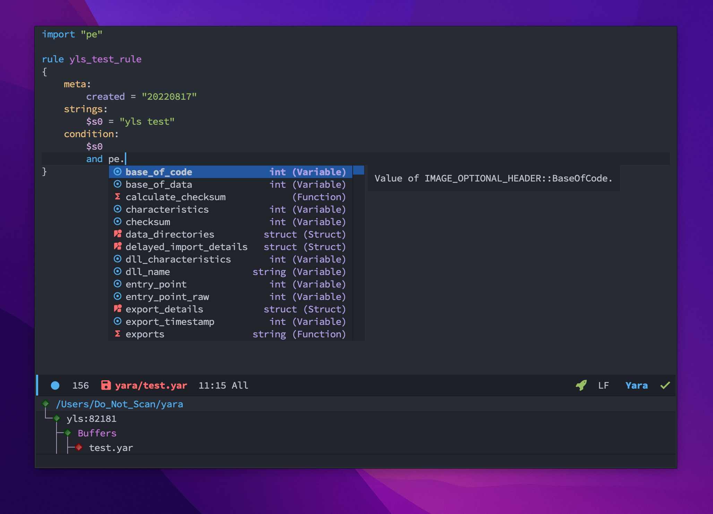

* yara-mode

[[http://melpa.org/#/yara-mode][file:http://melpa.org/packages/yara-mode-badge.svg]]

yara mode for GNU Emacs to edit yara related files.

(require 'yara-mode)

** How to use YARA Language Server?

Install the official YARA-X Language Server (~yr-ls~) from [[https://github.com/VirusTotal/yara-x][VirusTotal/yara-x]]:
#+begin_src bash
cargo install yara-x-ls
#+end_src

*** Eglot (Emacs 29+)

~yara-mode~ automatically registers ~yr-ls~ with ~eglot~. Simply call ~M-x eglot~ or add to your ~init.el~:
#+begin_src elisp
(add-hook 'yara-mode-hook #'eglot-ensure)
#+end_src

*** lsp-mode

To use ~lsp-mode~, add the following to your ~init.el~:
#+begin_src elisp
(with-eval-after-load 'lsp-mode
  (add-to-list 'lsp-language-id-configuration
    '(yara-mode . "yara"))

  (lsp-register-client
    (make-lsp-client :new-connection (lsp-stdio-connection '("yr-ls"))
                     :activation-fn (lsp-activate-on-modes 'yara-mode)
                     :server-id 'yara-x-ls)))

(add-hook 'yara-mode-hook #'lsp-deferred)
#+end_src

#+name: YARA-X Language Server in GNU Emacs
#+attr_org: :height 800 :width 600

